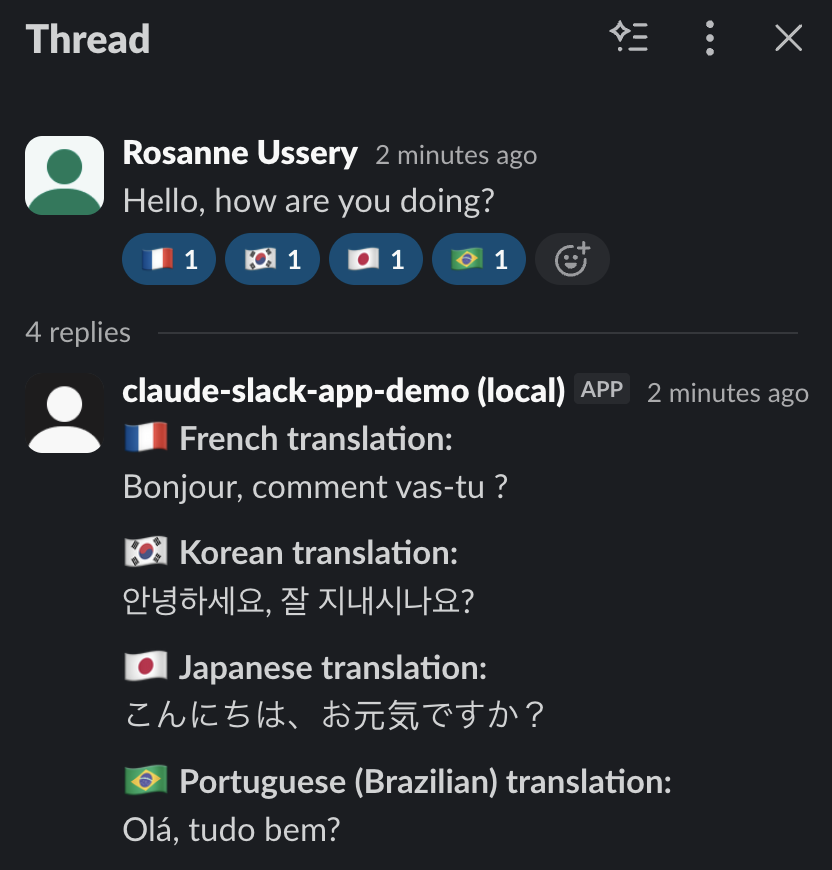
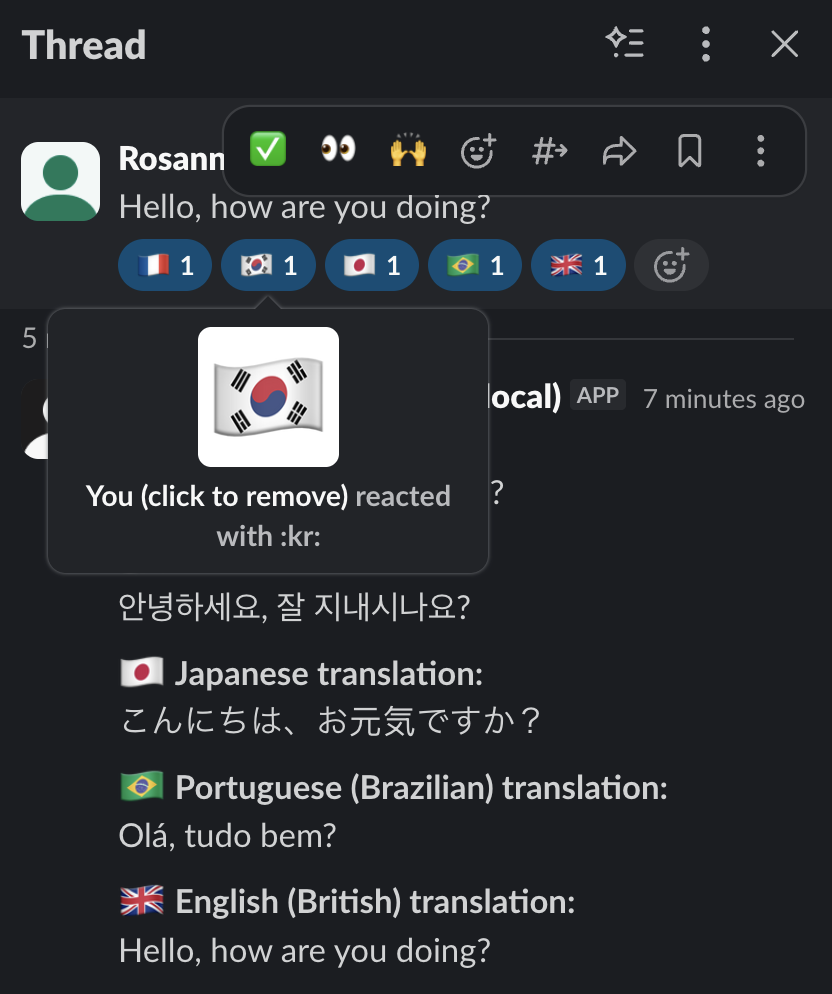

# Emoji Translator - Slack App

A Slack app that translates messages when you react with a country flag emoji. Powered by [DeepL](https://www.deepl.com/) and built with [Bolt for JavaScript](https://tools.slack.dev/bolt-js/).



## Features

- **Flag emoji reactions** — React to any message with a country flag emoji (e.g. :fr:, :de:, :jp:) to auto-detect the source language and post a translation as a threaded reply
- **40+ supported languages** — Covers all DeepL-supported target languages mapped to country flags, including regional variants (e.g. :br: for Brazilian Portuguese, :gb: for British English)
- **Auto-join channels** — The bot automatically joins all public channels on startup and new channels as they are created, so it can receive reactions everywhere
- **Unsupported flag handling** — Reacting with a flag that has no language mapping replies with a helpful message naming the country
- **Non-translatable message guards** — Bot messages, file uploads, and mention-only messages are detected and skipped with an explanation in the thread
- **Error notifications** — If a translation fails, the bot replies in the thread with the error details

## Getting Started

### Prerequisites

- [Node.js](https://nodejs.org/) v22 or later
- A [Slack workspace](https://slack.com/create) where you have permission to install apps
- A [DeepL API key](https://www.deepl.com/pro-api) (free tier works)

### 1. Clone and install

```sh
git clone https://github.com/st-artichokey/emoji-tr-app.git
cd emoji-tr-app
npm install
```

### 2. Create a Slack app

1. Go to [api.slack.com/apps/new](https://api.slack.com/apps/new) and choose **From an app manifest**
2. Select your workspace
3. Paste the contents of [`manifest.json`](./manifest.json) and click **Next**
4. Review the configuration and click **Create**
5. Click **Install to Workspace** and **Allow**

### 3. Configure environment variables

```sh
cp .env.sample .env
```

Fill in your `.env` file:

| Variable | Where to find it |
|---|---|
| `SLACK_BOT_TOKEN` | **OAuth & Permissions** > Bot User OAuth Token (`xoxb-...`) |
| `SLACK_APP_TOKEN` | **Basic Information** > App-Level Token with `connections:write` scope (`xapp-...`) |
| `DEEPL_API_KEY` | [DeepL API account](https://www.deepl.com/pro-api) |

### 4. Run the app

```sh
npm start
```

For development with auto-restart on file changes:

```sh
npm run dev
```

## Usage

1. Find any message in a channel the bot has joined
2. React with a country flag emoji (e.g. :fr: for French, :de: for German)
3. The bot replies in a thread with the translation



### Supported flags

| Flag | Language | Flag | Language |
|------|----------|------|----------|
| :fr: | French | :de: | German |
| :es: | Spanish | :it: | Italian |
| :jp: | Japanese | :kr: | Korean |
| :gb: | English (British) | :us: | English (American) |
| :br: | Portuguese (Brazilian) | :pt: | Portuguese (European) |
| :cn: | Chinese (Simplified) | :tw: | Chinese (Traditional) |
| :ru: | Russian | :ua: | Ukrainian |
| :pl: | Polish | :nl: | Dutch |
| :se: | Swedish | :dk: | Danish |
| :fi: | Finnish | :no: | Norwegian |
| :ro: | Romanian | :hu: | Hungarian |
| :cz: | Czech | :sk: | Slovak |
| :bg: | Bulgarian | :gr: | Greek |
| :tr: | Turkish | :id: | Indonesian |

Additional country flags (e.g. :mx:, :ar:, :co:, :at:, :ch:, :sa:, :eg:) map to the appropriate language. See [`listeners/languages.js`](./listeners/languages.js) for the full mapping.

## Testing

```sh
npm test
```

Runs 68 unit tests using the [Node.js built-in test runner](https://nodejs.org/api/test.html) with [esmock](https://www.npmjs.com/package/esmock) for ESM module mocking.

## Project Structure

```
├── app.js                          # Entry point — Socket Mode, auto-joins channels
├── app-oauth.js                    # Alternative entry point for HTTP/OAuth deployments
├── manifest.json                   # Slack app manifest (scopes, events, features)
├── listeners/
│   ├── index.js                    # Registers all listener groups
│   ├── languages.js                # Language maps, flag mapping, country names
│   ├── translate.js                # DeepL wrapper and Slack formatting stripper
│   ├── slack-helpers.js            # Shared Slack utilities (sendDM)
│   └── events/
│       ├── index.js                # Registers event listeners
│       ├── reaction-added.js       # Flag emoji reaction → translate → thread reply
│       ├── app-home-opened.js      # App Home tab with usage instructions
│       └── channel-join.js         # Auto-join channels on startup and creation
├── tests/                          # Unit tests mirroring listeners/ structure
└── claude-session-logs/            # Development session logs
```

## Built With

- [Slack Bolt for JavaScript](https://tools.slack.dev/bolt-js/) — Slack app framework
- [DeepL API](https://developers.deepl.com/docs/getting-started/supported-languages) — Translation engine
- [Node.js test runner](https://nodejs.org/api/test.html) + [esmock](https://www.npmjs.com/package/esmock) — Testing

## License

[MIT](./LICENSE)
